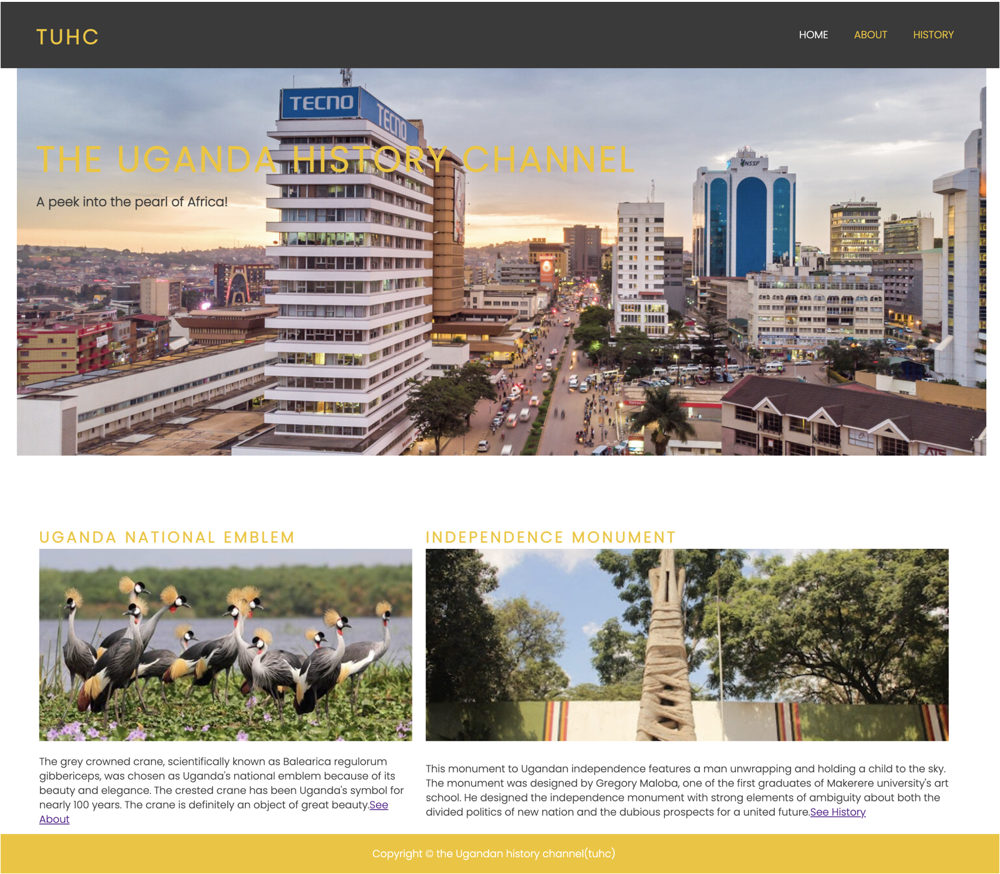

# **TUHC**
The Ugandan history channel is a website about the history of Uganda.

TUHC is a website dedicated to keeping people educated about Uganda as a country, its people, the political climate, geographical climate, geographic regions, and economic climate in the past and present. The website will be aimed towards historians and students from Uganda and throughout the world. The general population in Uganda, as well as the rest of the globe, will benefit from the knowledge and usage of TUHC.

# Features
1. **Navigation Bar**

  * The entire navigation bar is responsive and is included on all three pages. It provides links to the Home page, About page, and History page. It is the same on each page to facilitate easy navigation. 
  * This section allows users to simply go from page to page across all devices without having to use the ‘back’ button to return to the previous page.

  

2. **The main Home Image**

  * The main Home image comprises an attractive photograph of Kampala city with text overlay to help the viewer   understand what this site is about and where it will be useful.

  

3. **The cases section**

 * The case section will allow the user to see some of the history of Uganda starting with the Uganda crested crane and the Uganda independence monument.  The case section contains two attractive photos and links that should encourage the user to connect to the About page and History page for more information.

 

4. **The footer**

 * The footer section here includes the copyright information of TUHC.

 

5. **The home**

 * The home is the main page of the TUHC site. It contains the features mentioned above

 

 6. **The About Page**

 * The About page will allow the user to learn facts and history of Uganda which is presented in different sections pertaining to the geographical location, the people and the economic activities.

 * The About section will allow the user to subscribe to the TUHC to be a part of the Ugandan history community. The subscribe form in the About section will enable the user to access more information and get timely TUHC updates.

 

 7. **The History page**

 * The history page section will allow the user to learn about the past and present history of Uganda.

 

 8. **The history search form**

 * This section will allow the user to search for past and present facts and any history pertaining to Uganda. The section is linked to Google search to enable the user to acquire the information they are searching for.

 

 9. **Features left to implement**

 * Link TUHC to social media platforms like Instagram and Facebook


------

## Release History

We continually tweak and adjust this template to help give you the best experience. Here is the version history:

**September 1 2021:** Remove `PGHOSTADDR` environment variable.

**July 19 2021:** Remove `font_fix` script now that the terminal font issue is fixed.

**July 2 2021:** Remove extensions that are not available in Open VSX.

**June 30 2021:** Combined the P4 and P5 templates into one file, added the uptime script. See the FAQ at the end of this file.

**June 10 2021:** Added: `font_fix` script and alias to fix the Terminal font issue

**May 10 2021:** Added `heroku_config` script to allow Heroku API key to be stored as an environment variable.

**April 7 2021:** Upgraded the template for VS Code instead of Theia.

**October 21 2020:** Versions of the HTMLHint, Prettier, Bootstrap4 CDN and Auto Close extensions updated. The Python extension needs to stay the same version for now.

**October 08 2020:** Additional large Gitpod files (`core.mongo*` and `core.python*`) are now hidden in the Explorer, and have been added to the `.gitignore` by default.

**September 22 2020:** Gitpod occasionally creates large `core.Microsoft` files. These are now hidden in the Explorer. A `.gitignore` file has been created to make sure these files will not be committed, along with other common files.

**April 16 2020:** The template now automatically installs MySQL instead of relying on the Gitpod MySQL image. The message about a Python linter not being installed has been dealt with, and the set-up files are now hidden in the Gitpod file explorer.

**April 13 2020:** Added the _Prettier_ code beautifier extension instead of the code formatter built-in to Gitpod.

**February 2020:** The initialisation files now _do not_ auto-delete. They will remain in your project. You can safely ignore them. They just make sure that your workspace is configured correctly each time you open it. It will also prevent the Gitpod configuration popup from appearing.

**December 2019:** Added Eventyret's Bootstrap 4 extension. Type `!bscdn` in a HTML file to add the Bootstrap boilerplate. Check out the <a href="https://github.com/Eventyret/vscode-bcdn" target="_blank">README.md file at the official repo</a> for more options.

------

## FAQ about the uptime script

**Why have you added this script?**

It will help us to calculate how many running workspaces there are at any one time, which greatly helps us with cost and capacity planning. It will help us decide on the future direction of our cloud-based IDE strategy.

**How will this affect me?**

For everyday usage of Gitpod, it doesn’t have any effect at all. The script only captures the following data:

- An ID that is randomly generated each time the workspace is started.
- The current date and time
- The workspace status of “started” or “running”, which is sent every 5 minutes.

It is not possible for us or anyone else to trace the random ID back to an individual, and no personal data is being captured. It will not slow down the workspace or affect your work.

**So….?**

We want to tell you this so that we are being completely transparent about the data we collect and what we do with it.


```

```


---


