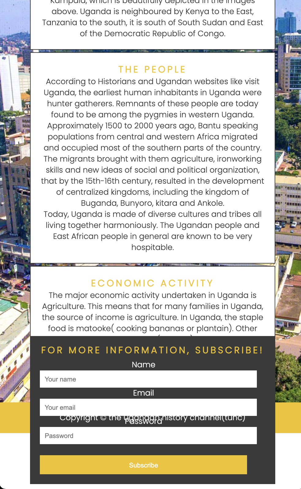

# **TUHC**
The Ugandan history channel is a website about the history of Uganda.

TUHC is a website dedicated to keeping people educated about Uganda as a country, its people, the political climate, geographical climate, geographic regions, and economic climate in the past and present. The website will be aimed towards historians and students from Uganda and throughout the world. The general population in Uganda, as well as the rest of the globe, will benefit from the knowledge and usage of TUHC.

# Features
1. **Navigation Bar**

  * The entire navigation bar is responsive and is included on all three pages. It provides links to the Home page, About page, and History page. It is the same on each page to facilitate easy navigation. 
  * This section allows users to simply go from page to page across all devices without having to use the ‘back’ button to return to the previous page.

  

2. **The main Home Image**

  * The main Home image comprises an attractive photograph of Kampala city with text overlay to help the viewer   understand what this site is about and where it will be useful.

  

3. **The cases section**

 * The case section will allow the user to see some of the history of Uganda starting with the Uganda crested crane and the Uganda independence monument.  The case section contains two attractive photos and links that should encourage the user to connect to the About page and History page for more information.

 

4. **The footer**

 * The footer section here includes the copyright information of TUHC.

 

5. **The home**

 * The home is the main page of the TUHC site. It contains the features mentioned above

 

 6. **The About Page**

 * The About page will allow the user to learn facts and history of Uganda which is presented in different sections pertaining to the geographical location, the people and the economic activities.

 * The About section will allow the user to subscribe to the TUHC to be a part of the Ugandan history community. The subscribe form in the About section will enable the user to access more information and get timely TUHC updates.

 

 7. **The History page**

 * The history page section will allow the user to learn about the past and present history of Uganda.

 

 8. **The history search form**

 * This section will allow the user to search for past and present facts and any history pertaining to Uganda. The section is linked to Google search to enable the user to acquire the information they are searching for.

 

 9. **Features left to implement**

 * Link TUHC to social media platforms like Instagram and Facebook

## Testing
-----------
1. **The functionality of the site**

* TUHC site consists of features three pages namely: the Home page, About page, and History page. TUHC site has a navigation bar that runs across all the pages of the site for easy navigation. 

* The navigation bar has an active menu. When a user opens the TUHC site, they will navigate from page to page using this feature. Also, the color of the active menu items is white whereas the inactive pages remain colored yellow. The white color shows the user which page they are on.

* The Home page contains two links in the case section. The first link allows the user to connect or link to the About page from the home page and the second link allows the user to go straight to the history page from the home page.

* TUHC site has a form on the about page to encourage users to subscribe. The users will be able to enter their names, emails, and passwords and thereafter subscribe to be part of the Ugandan history community and use that subscription to get new updates from TUHC.

* The history page of TUHC also contains a search form. The ‘search our history’ section will allow the user to search for any piece of history about Uganda. This search form when clicked by a user opens up in a new tab linked to the google search page.

* I have tested the functionality through code inspection and am happy to report that the TUHC site features function as intended.

2. **Responsiveness**

* TUHC site is responsive to different media devices. Media queries are set for different device views with a maximum width of 770 pixels and 600 pixels or below. 

* I have tested the responsiveness of the TUHC site and therefore, I am happy to report that through code inspection, the TUHC site responds well to different device views.

3. **Bugs and fixes**

* **Bug 1:** Aside element on the about page going below the footer in small device views.

* *FIX 1:* Hiding the element in small device views and displaying a fitting form using media queries. The fix. also includes hiding the created form on large displays.

* **Note:** For this project, two forms for the about page are created and each displays using a different view. One subscribe-form for the large screens and the other for the small device views.

**Why two forms?**

* *Unresolved Challenge:* the initial code had one subscribe-form for all the different views. However, during the code inspection and while checking the responsiveness of the site. The subscribe-form on the about page was overlapping the footer on the about page. The footer however remains static on the Home and History pages, and I could not resolve this challenge no matter how I changed the code.

* For this project, the challenge as seen in the screenshot is partially resolved (using the two forms above). 

* **Bug 2:** Hidden overflow in about page of the site.

* *FIX 2:* Removing the hidden overflow for the parent class of the overflowing article by changing giving the overflow property a value of auto.

### Validator Testing

* HTML

No errors were returned when passing through the official W3C validator

* CSS

No errors were found when passing through the official (Jigsaw) validator

### Unfixed Bugs

All the errors are fixed, however, one warning on the about page is ignored during validation. The warning pertains to assigning the section a heading. The warning is ignored because the section in question already has several headings within it.

## Deployment
------
The site was deployed to GitHub pages. The steps to deploy are as follows:

* In the GitHub repository, navigate to the Settings tab

* From the source section drop-down menu, select the Master Branch

* Once the master branch has been selected, the page will be automatically refreshed with a detailed ribbon display to indicate the successful deployment.

* The live link can be found here -https://radee1.github.io/the-ugandan-history-channel/

## Credits
--------

1. **Content**

 * The text for the Home page about the independence monument was taken from Lakato safaris https://www.lakatosafaris.com/the-independence-monument/

 * Text for the home page about the Uganda national emblem was taken from- https://berlin.mofa.go.ug/data-dnews-24-THE-CRESTED-CRANE---UGANDA'S-NATIONAL-EMBLEM.html

 * Text about the economic activity in the about page was taken from- https://www.peacecorps.gov/educators/resources/cuisine-and-etiquette-uganda/

 * Text on the about page and history page was taken from- https://visituganda.com/explore/category/history-of-uganda and https://www.britannica.com/summary/Uganda

 * Text on the history page was taken from BBC news-https://www.bbc.com/news/world-africa-14112446
 
 * The font-family applied in the CSS page and over all TUHC site was adopted from Google fonts- https://fonts.google.com/

 * Some CSS code inspired from Lecture slides and love running project for things such as images, and zoom effects.

 2. **Media**

 * The photos used on the home, about and history page are from this open-source site- https://commons.wikimedia.org/wiki/File:Uganda_Independence_Monument.jpg

 * https://berlin.mofa.go.ug/data-dnews-24-THE-CRESTED-CRANE---UGANDA%27S-NATIONAL-EMBLEM.html

 * Pixabay-https://pixabay.com/images/search/uganda/

 * Google free image downloads.

